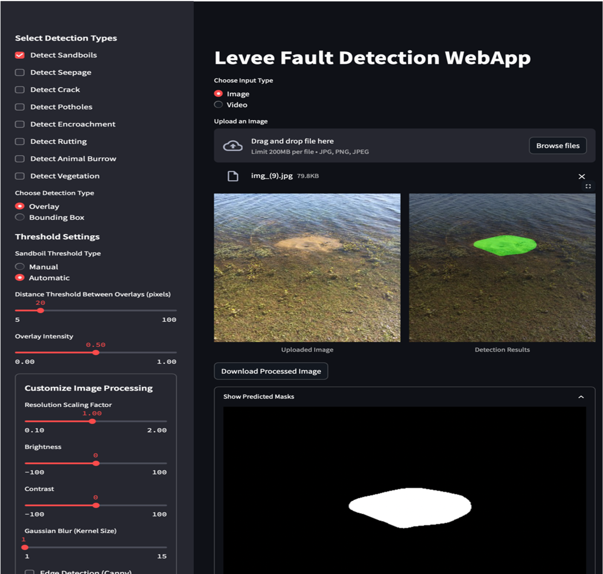

# Levee_Fault_Detection_WebApp
A web-based application for automated detection of levee-related anomalies such as sandboils, seepage, cracks, and more. The system uses deep learning-based semantic segmentation models to identify structural faults in real-time.
This tool is designed to assist infrastructure monitoring teams in making faster, more accurate decisions by providing both visual and quantitative feedback on possible defect areas. 

Interface:



## Getting Started:

### 1. Clone the Repository

```bash
git clone https://github.com/padam56/Levee_Web_Detection.git
cd Levee_Web_Detection
```

### Install Dependencies

```bash
conda env create -f environment.yml
conda activate levee_fault_env
```

### Run the Application

```bash
streamlit run FINAL.py
```

The app will launch in your browser at http://localhost:8501. 
